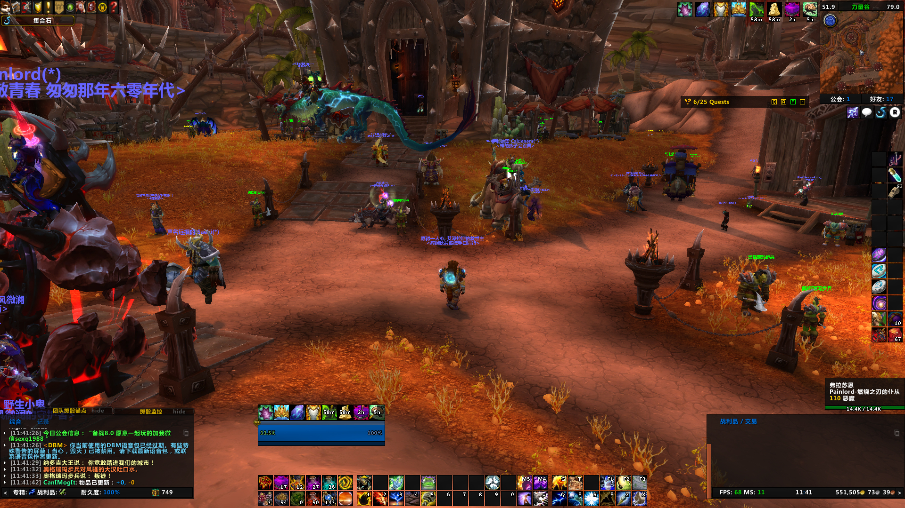
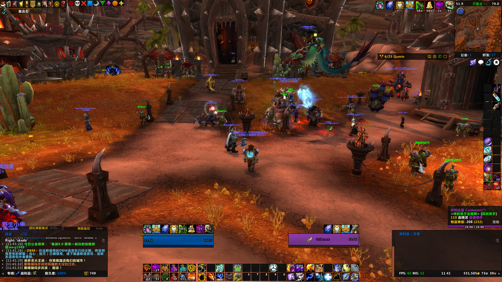
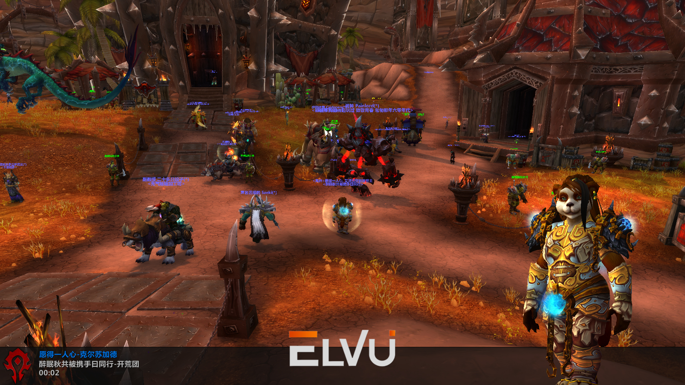

## wow_addons & wow_addons_private_use 魔兽世界自用整合插件
魔兽世界官方正式服务器自用整合插件。

LEG时期全部为单体插件（支持直接单独插件使用，部分模块化插件除外），非集中模块化整合类插件（与网易有爱、大脚、多玩魔盒等不同）。

自BFA前夕开始改用[ElvUI](https://www.tukui.org/download.php?ui=elvui&changelog)整合界面插件+部分单体插件组合使用。

以适用于自身为基准，目前主玩萨满祭司（恢复），所以界面、插件将针对此做出必要调整，并未考虑是否适用于其他专精、职业。

特别提示：部分插件可能功能有重叠，应当只使用其中一个或选择性使用。

## 使用方法
将addons文件夹放置在```游戏根目录/interface/```下，例如```D:\World of Warcraft\interface\addons```，进入后便是插件列表，避免出现```D:\World of Warcraft\interface\addons\addons```等情况。

## 效果图
一般


选中他人


AFK离开状态（```/afk```）


更多效果图可以查看[Screenshots](./Screenshots/)文件夹。

## 插件列表
全部插件请看[插件列表](addonslist.md)。

## 许可证
请查阅[LICENSE](LICENSE)。

## 说明、贡献指南
如有兴趣使用，可使用全部插件或提取部分插件使用。

均不包含插件配置、界面配置信息（个人的WTF文件），需要自行配置各个插件（通常是位置）。

部分插件支持命令，例如/dbm，等等。其他插件可以在界面-插件里修改。

## 插件维护更新方式
ElvUI下载地址：https://www.tukui.org/download.php?ui=elvui&changelog

集合石插件：http://w.163.com/special/wowsocial/

自动截图插件：http://bbs.ngacn.cc/read.php?tid=7534350

TinyInspect、Tiny系列：http://bbs.ngacn.cc/read.php?tid=10240957

SimpleChat：http://bbs.ngacn.cc/read.php?tid=9633520

SkadaPlus：https://github.com/Yeatol/SkadaPlus

其他单体插件可用curse客户端管理，curse客户端下载地址：https://www.curseforge.com/twitch-client

## 一些有用的重要命令
在游戏内聊天窗口输入，然后回车：

最远镜头距离：`/console cameraDistanceMaxZoomFactor 2.6`

总是对比装备：`/console alwaysCompareItems 1`

以上命令可借助插件AdvancedInterfaceOptions、ElvUI_WindTools控制。

WTF（WOW安装目录/WTF/config.wtf）：

在配置文件内添加以下内容（可能会被覆盖掉，可由插件AdvancedInterfaceOptions再次单角色控制）

```
SET overrideArchive "0"
SET profanityFilter "0"
```