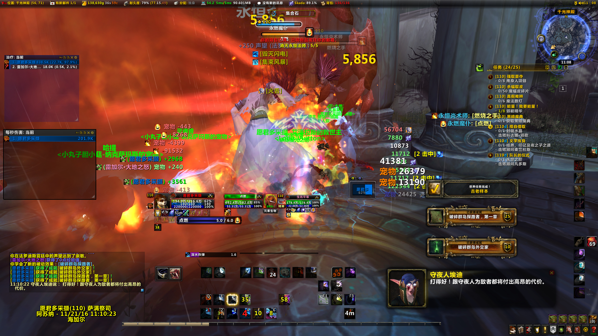

# wow_addons_private_use
# wow_addons
======================

## 魔兽世界（7.x）自用插件

仅整理单体，非整合插件。

以适用于自身为基准，并不考虑所有人，以恢复萨满祭司界面为基准。

## 效果图
。

更多效果图可以查看[Screenshots](./Screenshots/)文件夹。

## 插件列表
全部插件请看[插件列表](addonslist.md)。

## 许可证
请查阅[LICENSE](LICENSE)。

## 说明
如有兴趣使用，可使用全部插件或提取部分插件使用.

均不包含插件配置、界面配置信息（个人的WTF文件），需要自行配置各个插件（通常是位置，如zperl）。

部分插件支持命令，例如/bt4，/dbm，等等。其他插件可以在界面-插件里直接进行修正。

